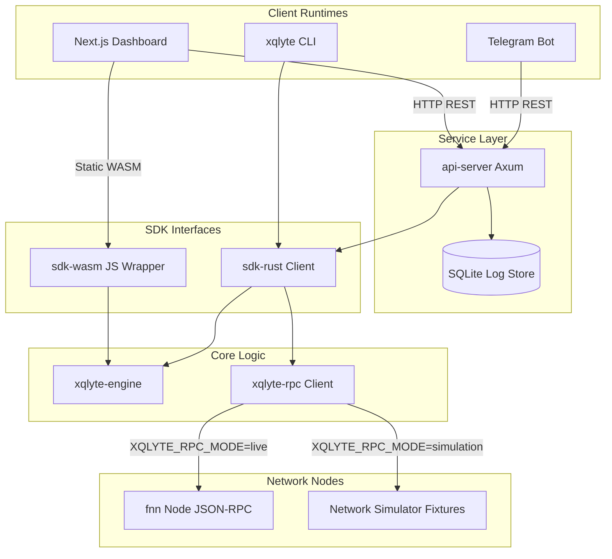

# ⚡️ XQlyte

### A payment diagnostics & confidence engine for the Nervos Fiber Network — pre-flight feasibility checks, root-cause failure diagnostics, and recovery recommendations.

[](crates/engine)
[](packages/dashboard)
[](crates/sdk-wasm)
[](crates/api-server)
[](packages/bot)
[](#running-tests)

**Built for the Gone in 60ms: Fiber Network Infrastructure Hackathon · Category 1 (Wallet/Payment UX) & Category 2 (Node/Diagnostics)**

[**▶ Watch the 5-Minute Technical Demo**](https://video.xqlyte.com) · [**Live Documentation Platform**](http://localhost:3000/docs)

---

## 📖 The Problem — UX Churn & Blind Routing in Off-Chain Payments

The **Nervos Fiber Network** provides ultra-fast, low-cost off-chain multi-asset payment channels on CKB. However, off-chain networks operate with limited global visibility to preserve channel privacy. When an off-chain transaction fails, users are met with generic, unhelpful "Payment Failed" errors. A transaction can bounce for several reasons:

1. **Routing Blindness & Capacity Drift:** A middle hop along the path lacks the outbound local balance in the specific direction of your transfer, even if their total channel capacity is sufficient.
2. **UDT Custom Script Mismatches:** A node in the routing path does not have the lock/typescript cells required to handle a User Defined Token (UDT) or RGB++ asset.
3. **Fee Spikes:** Cumulative fees computed by the pathfinder exceed the sender's maximum fee allowance.
4. **Node Instability:** A routing hop drops offline or experiences poor peer-to-peer network gossip latency.

Without pre-flight diagnostics, wallets broadcast transactions blindly, resulting in locked liquidity (during TLC expiries), wasted fees, and poor user flow. 

**XQlyte permanently eliminates this friction** by acting as an intelligence layer on top of Fiber:
* **Pre-flight Feasibility (`can_pay`):** Simulates route conditions and scores transactions (0–100) before broadcasting.
* **Root-Cause Classification (`diagnose_failure`):** Categorizes failures into 8 distinct buckets, pointing directly to the offending hop or asset script.
* **Actionable Suggestions:** Emits human-readable recovery remedies (e.g. swap paths, rebalancing limits, or fee adjustments).

---

## 🏆 How it's Judged — Judging Criteria Scoring Matrix

XQlyte is engineered to score highly across all 12 official hackathon evaluation criteria:

| Evaluation Criterion | Implementation Details in XQlyte | Key File References |
| :--- | :--- | :--- |
| **Functional Completeness** | End-to-end check pipeline: request validators, 5 scoring analyzers, 8 failure categorizers, SQLite logging, web UI, CLI, and Telegram bot. | [`crates/engine/src`](crates/engine/src) |
| **User Flow & Experience** | Hides raw channel parameters behind a simple 0-100 Confidence Score, with clear color-coded badges, risk lists, and user-centric remedies. | [`packages/dashboard`](packages/dashboard) |
| **Relevance to Fiber** | Specifically targets Fiber's unique multi-hop capacity, fee budgets, and multi-asset UDT script cells. | [`crates/engine/src/asset_analyzer.rs`](crates/engine/src/asset_analyzer.rs) |
| **Usefulness to Devs/LSPs** | Exposes library SDKs for wallets (WASM) and backend node services (Rust), plus a REST server and SQLite logs for node auditing. | [`crates/sdk-wasm`](crates/sdk-wasm) · [`crates/api-server`](crates/api-server) |
| **Technical Soundness** | 100% safe, fast Rust engine, compiling to both native targets and WebAssembly. Decoupled traits separate core logic from RPC I/O. | [`crates/engine`](crates/engine) · [`crates/rpc`](crates/rpc) |
| **Reusability** | Fully packaged as separate Rust crates, a Node/WASM NPM package, a CLI binary, and an Axum HTTP API service. | [`crates/Cargo.toml`](Cargo.toml) |
| **Integration Potential** | Trait-based RPC adapter allows drops directly into any running Fiber node client (`fnn`) without modifying peer code. | [`crates/rpc/src/client.rs`](crates/rpc/src/client.rs) |
| **Documentation Quality** | Premium developer documentation page with searchability (Ctrl+K palette), interactive SVG topologies, and copy-paste code integration blocks. | [`packages/dashboard/src/app/(marketing)/docs`](packages/dashboard/src/app/\(marketing\)/docs) |
| **Maintainability** | Clean monorepo workspace topology, standard Clippy configs, decoupling traits, and 100% test fixture determinism. | [`Cargo.toml`](Cargo.toml) · [`rustfmt.toml`](rustfmt.toml) |
| **Practical Value** | Prevents dead-end payments, fee spikes, and locked CKB/UDT liquidity by checking route validity beforehand. | [`crates/engine/src/lib.rs`](crates/engine/src/lib.rs) |
| **Fit Within Category** | Delivers Category 1 value (wallet UX and pre-flight checklist) and Category 2 value (path observability and error reports). | [`docs/PROJECT_PLAN.md`](docs/PROJECT_PLAN.md) |
| **Future Development** | Core traits support pluggable scoring analyzers (e.g. ML latency predictions, automated channel rebalancers). | [`crates/engine/src/confidence_model.rs`](crates/engine/src/confidence_model.rs) |
| **Wider Fiber Stack Fit** | Pure Rust design means the scoring logic can be compiled directly into the official `fnn` daemon as a standard RPC endpoint. | [`crates/sdk-rust`](crates/sdk-rust) |

---

## 🛠 How it Works — Architecture & Pipelines

XQlyte is composed of multiple subsystems coordinating via the core `sdk-rust` and `sdk-wasm` packages:



### The Pre-Flight Scoring Pipeline

When a diagnostics query runs, the request goes through a 5-step analysis pipeline:

```
[1. Payment Request] ─► [2. Input Validator] ─► [3. RPC Node Fetch]
                                                       │
  ┌────────────────────────────────────────────────────┘
  ▼
[4. Core Scorer Engine]
  ├── Route Scorer (30 pts)  ──► Hop counts & node connections
  ├── Asset Scorer (20 pts)  ──► Native support vs Swaps compatibility
  ├── Liquidity Scorer (30 pts)► Outbound local balances
  ├── Fee Scorer (10 pts)    ──► Fees ratio to amount budget
  └── Node Scorer (10 pts)   ──► Stability & peer uptime stats
  │
  ▼
[5. Final Classification] ──► CanPay (70-100) | Unknown (41-69) | CannotPay (0-40)
                          ──► Returns diagnose() & suggested_remedy()
```

---

## 📦 Repository Layout

We utilize a Rust cargo workspace monorepo alongside a pnpm Javascript monorepo package layout:

```text
xqlyte/
├── Cargo.toml                  # Cargo Workspace Root
├── docs/                       # Specifications, project plans, and manual test logs
├── crates/
│   ├── engine/                 # Pure diagnostic arithmetic (validator, 5 analyzers, scorer)
│   ├── rpc/                    # Fiber JSON-RPC adapters (Simulation vs Live clients)
│   ├── sdk-rust/               # Rust Orchestrator linking RPC with Scorer
│   ├── sdk-wasm/               # JS/TS WebAssembly bindings (wasm-bindgen)
│   ├── cli/                    # Clap CLI diagnostic utility binary
│   └── api-server/             # Axum REST API server & SQLite database logging
├── packages/
│   ├── xqlyte-js/              # Javascript SDK wrapper loading WASM target assets
│   ├── bot/                    # Node.js Telegram Bot daemon (grammY)
│   └── dashboard/              # Next.js web dashboard interface (React)
└── README.md                   # Repository Roadmap
```

---

## 🔍 The Failure Diagnostics Matrix (Failure Taxonomy)

XQlyte translates low-level JSON-RPC failures into structured diagnostic error records:

| Category | Trigger Cause | Technical Scanned Metric | Suggested Fix | Retry Strategy |
| :--- | :--- | :--- | :--- | :--- |
| **Capacity** | Intermediary hop balance exhaustion. | `local_balance < request_amount` | Add local liquidity / rebalance channel / reduce payment size. | Rebalance the channel or route via alternative nodes. |
| **Asset** | Hop node lacks UDT script configuration. | `funding_udt_type_script` mismatch | Use recommended native asset or enable swap path. | Configure a swap provider or request a supported asset. |
| **Route** | No physical channel connection route exists. | Empty path list returned | Re-check network peers, use alternative tokens. | Connect to more peers or verify routing graph channels. |
| **Fee** | Path cumulative fee exceeds maximum budget. | `route_fee > max_fee_threshold` | Increase fee budget or select a shorter route. | Adjust maximum fee limits in settings and retry. |
| **Node** | Target routing hop is offline. | Node uptime or connectivity offline | Reconnect peer node or avoid unstable hop. | Wait for peer node reconnection or route around peer. |
| **Timeout** | Cumulative lock times exceed safety boundary. | `tlc_expiry > safety_blocks` | Select a shorter path or increase expiry settings. | Reduce the number of path hops or increase lock parameters. |
| **Swap** | Swap provider lacks liquidity or is offline. | Swap RPC balance is insufficient | Use supported native asset or try alternative swap node. | Verify swap provider status and check liquidity limits. |
| **Unknown** | Incomplete graph data or RPC connection error. | Fetch timeout or gossip stale | Refresh network graph database and retry query. | Refresh node gossip database and check RPC connectivity. |

---

## ⚙️ Architecture Modes & Environments

To facilitate both testing and live deployment conditions, the RPC interface layer supports two operational modes configurable via environment variables:

1. **Simulation Mode (Default):** Runs deterministic local topology scenarios representing capacity failures (`capacity-fail`), node dropouts (`node-fail`), and swap script issues. Perfect for validation scripts, CI pipelines, and manual review.
2. **Live Node Mode:** Hooks directly into your active `fnn` RPC node client over JSON-RPC. Fetches live routing table graph topologies and channel parameters dynamically.

---

## 🚀 Getting Started & Local Run Guide

### 1. Clone the Repository & Verify Prerequisites
To begin setup, clone the code repository and verify your toolchain satisfies the requirements:
```bash
# Clone the repository
git clone https://github.com/Temitope15/xqlyte.git
cd xqlyte

# Verify toolchains
rustc --version # Stable Rust (compatible with 2024 edition)
node --version  # Node.js >= 18
pnpm --version  # pnpm package manager (npm / yarn can also be used)
```

### 2. Build the Cargo Workspace
Build the core diagnostic engine, Axum server, and CLI tools:
```bash
cargo build --workspace
```

### 3. Running Unit & Integration Tests
Run the workspace test suite to verify scoring arithmetic and validation heuristics:
```bash
cargo test --workspace
```

### 4. Running the CLI Tool
Query diagnostic checks directly from your terminal. The CLI supports all standard and aliased commands:
```bash
# Happy path payment (High confidence score, CanPay status)
cargo run -p cli -- can-pay --sender alice --receiver bob --amount 1000 --asset USDT

# Capacity failure path (Low confidence score, CannotPay status, displays Suggested Fix)
cargo run -p cli -- can-pay --sender alice --receiver bob --amount 100000 --asset USDT --scenario capacity-fail

# Diagnose failure details
cargo run -p cli -- diagnose --scenario node-fail
```

### 5. Running the REST API Server
Start the Axum service to listen on `http://127.0.0.1:3000` (persisting results to SQLite):
```bash
cargo run -p xqlyte-api-server
```

### 6. Running the Telegram Bot Daemon
Boot the bot daemon to respond to slash commands via Telegram's API:
```bash
# Configure bot environment and launch
cd packages/bot
npm install
npm start
```
*Note: Make sure your `api-server` is running, as the bot queries routing status through Axum endpoints.*

### 7. Running the Developer Dashboard
Launch the Next.js production/development console:
```bash
cd packages/dashboard
pnpm install
pnpm dev
```
Open `http://localhost:3000` in your web browser. You can trigger real-time routes in the interactive **Sandbox**, browse classifications in the **Failure Explorer**, or read the embedded **Docs** with visual dataflow charts.

---

## 🛣 Future Roadmap

* **Trustless Verification (Optimistic Window):** Replace API-driven metrics with optimistic challenge periods.
* **On-Chain Rebalancing Daemons:** Trigger automated local channel rebalancing when capacity warnings are flagged.
* **ML Route Latency Predictors:** Plug machine learning algorithms into the Node Analyzer to flag latency degradation before pathfinding.
* **RGB++ State Proof Sync:** Fetch and verify RGB++ proof cells dynamically before initiating asset swap routes.

---

## 📄 License
This project is licensed under the [MIT License](LICENSE).
