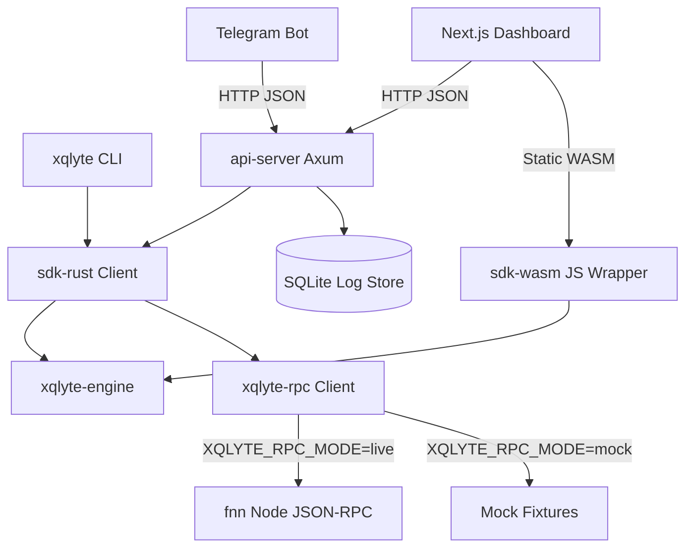

# XQlyte Architecture

XQlyte is architected with a strict separation of concerns, separating pure diagnostic logic from I/O boundaries.

## Workspace Layout

```
xqlyte/
  Cargo.toml                 # Workspace root config
  docs/                      # Alignment and specification documents
  crates/
    engine/                  # Pure logic, compiled to native + WASM
      src/
        types.rs             # Domain model data structures
        validator.rs         # Payment request input validator
        route_analyzer.rs    # Hop count, stability, fee, and path scoring
        asset_analyzer.rs    # Asset compatibility, swap and token checks
        liquidity_analyzer.rs# Inbound/outbound capacity and direction check
        fee_analyzer.rs      # Cost/ratio evaluation
        confidence_model.rs  # Combines analyzer scores into 0-100 metric
        failure_classifier.rs# Maps failed queries to taxonomy categories
        suggestion_engine.rs # Formulates user-centric fix recommendations
        lib.rs               # API facade: can_pay, diagnose_failure, etc.
    rpc/                     # Network interface boundary
      src/
        client.rs            # FiberRpcClient trait definition
        live.rs              # Real JSON-RPC client talking to fnn
        mock.rs              # Mock client returning static fixtures
        types.rs             # Low-level RPC data structures (ChannelData, etc.)
    sdk-rust/                # Rust orchestrator
    sdk-wasm/                # wasm-bindgen wrapper
    cli/                     # Clap CLI command line executable
    api-server/              # Axum HTTP API and SQLite Log Store
  dashboard/                 # Next.js web application
  bot/                       # Node.js Telegram bot daemon
```

## System Topology & Data Flow



### Flow description:
1. **Request Orchestration:** When a user checks `can-pay` via the CLI, Telegram Bot, or Dashboard:
   - The CLI and the `api-server` (backing the Bot and Dashboard) utilize `sdk-rust`.
   - Alternatively, front-end views can execute logic inside the browser by embedding the `sdk-wasm` package.
2. **RPC Fetching:** The SDK uses the `FiberRpcClient` trait (implemented by `LiveFiberRpcClient` or `MockFiberRpcClient`) to retrieve Channel, Route, Node, Asset, Fee, and Swap info.
3. **Pure Execution:** The SDK hands the raw RPC response structs directly to `xqlyte-engine`.
4. **Scoring & Classification:** The engine validates the request, scores each criteria via 5 standalone analyzers, calculates the Confidence Score, and flags any failure categories.
5. **Outcome Logging:** The results are passed to `log_result()`, which writes a JSONL/SQLite entry. The Dashboard and the CLI `log` command query this log store.

---

## Real fnn JSON-RPC Findings

From inspecting the raw Fiber E2E Bruno tests and node library definitions, we mapped the core `fnn` JSON-RPC API surface:

### Core Methods:
- **`node_info`**: Retrieves node state, public key, connected peer counts, configured parameters, and list of supported UDT configs.
- **`list_channels`**: Returns a list of active/pending channels (each with `channel_id`, `state`, `local_balance`, `remote_balance`, `funding_udt_type_script`, `pubkey` of the counterparty, `pending_tlcs`, etc.).
- **`graph_nodes`**: Paginated retrieval of network graph nodes including names, compressed pubkeys, and addresses.
- **`graph_channels`**: Paginated retrieval of network graph channels, capturing capacities and fee rates for each direction (`update_info_of_node1` / `update_info_of_node2`).
- **`build_router`**: Given an amount and a series of hops/constraints, pathfinds and returns an ordered route of `RouterHop` containing target pubkey, channel outpoint, amount received, and tlc expiry.
- **`send_payment`**: Dispatches a payment request to the network, returning a `payment_hash` and initial `PaymentStatus` (Created | Inflight | Success | Failed).
- **`get_payment`**: Retrieves status, routing history, and fees of a payment by its payment hash.

